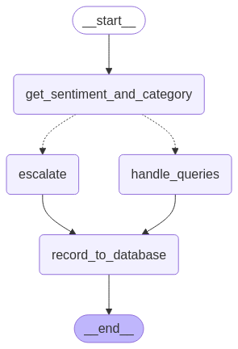
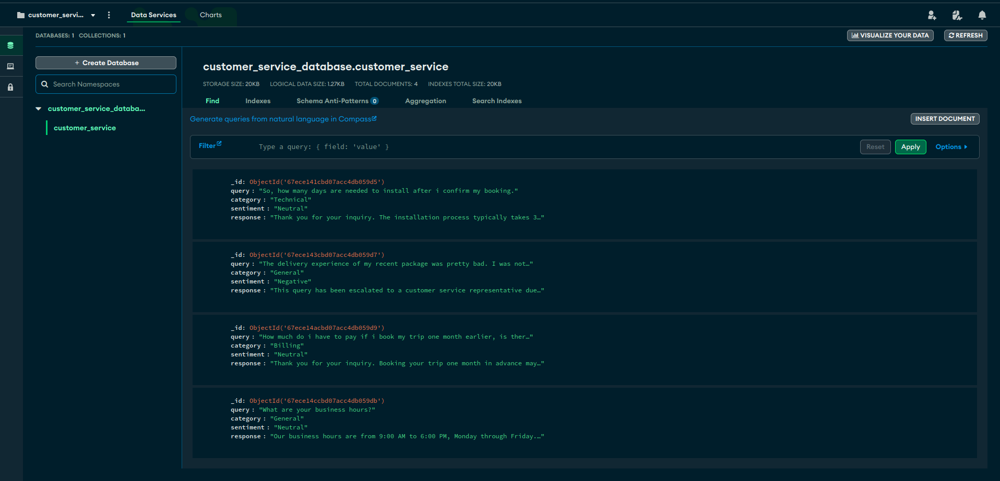
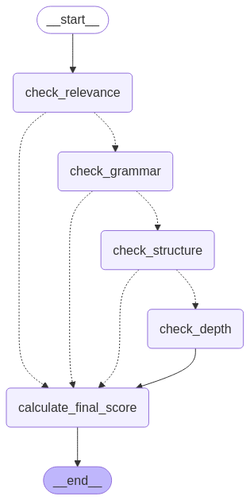

# AI Agents

## Intelligent Customer Service Agent

In today's fast-paced business environment, efficient and accurate customer support is crucial. Automating the initial stages of customer interaction can significantly reduce response times and improve overall customer satisfaction. This project aims to showcase how advanced language models and graph-based workflows can be combined to create a sophisticated support system that can handle a variety of customer inquiries.

### Key Components

1. State Management: Using TypedDict to define and manage the state of each customer interaction.

2. Query Categorization: Classifying customer queries into Technical, Billing, or General categories.
3. Sentiment Analysis: Determining the emotional tone of customer queries.
4. Response Generation: Creating appropriate responses based on the query category.
5. Escalation Mechanism: Automatically escalating queries with negative sentiment to human agents.
6. Workflow Graph: Utilizing LangGraph to create a flexible and extensible workflow.

### Method Details

1. Initialization: Set up the environment and import necessary libraries.

2. State Definition: Create a structure to hold query information, category, sentiment, and response.
3. Node Functions: Implement functions for categorization, sentiment analysis, and response generation.
4. Graph Construction: Use StateGraph to define the workflow, adding nodes and edges to represent the support process.
5. Conditional Routing: Implement logic to route queries based on their category and sentiment.
6. Database Integration: Saves the user interactions, query metadata, and response logs for analysis and continuous improvement.
7. Workflow Compilation: Compile the graph into an executable application.
8. Execution: Process customer queries through the workflow and retrieve results.

### Requirements

- python 3.10+
- python-dotenv
- langchain
- langchain_groq
- langGraph
- pymongo

### Graph Structure

### Sample Mongo Database Documents

### Conclusion

By combining natural language processing capabilities with a structured graph-based approach, we've created a customer support agent that can efficiently handle a wide range of queries. This system can be further extended and customized to meet specific business needs, potentially integrating with existing customer support tools and databases for even more sophisticated interactions.

## Essay Grading System

Automated essay grading systems can significantly streamline the assessment process in educational settings, providing consistent and objective evaluations. This implementation aims to demonstrate how large language models and graph-based workflows can be combined to create a sophisticated grading system.

### Key Components

1. State Graph: Defines the workflow of the grading process.

2. LLM Model: Provides the underlying language understanding and analysis.
3. Grading Functions: Functions for evaluation criteria.
4. Conditional Logic: Determines the flow of the grading process based on interim scores.

### Method Details

The system follows a step-by-step approach to grade essays:

1. Content Relevance: Assesses how well the essay addresses the given topic.

2. Grammar Check: Evaluates the essay's language usage and grammatical correctness.
3. Structure Analysis: Examines the organization and flow of ideas in the essay.
4. Depth of Analysis: Gauges the level of critical thinking and insights presented.

### Requirements

- python 3.10+
- python-dotenv
- langchain
- langchain_groq
- langGraph

### Graph Structure

### Conclusion

By leveraging the power of large language models and a graph-based workflow, the system offers a nuanced evaluation of essays that considers multiple aspects of writing quality. This system could be further refined and adapted for various educational contexts, potentially improving the efficiency and consistency of essay assessments.
